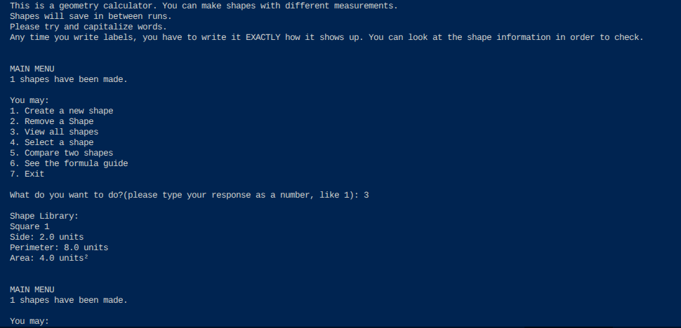

# Geometry Calculator
***

***
This is a program that lets the user create, remove, view, scale, and compare shapes. There is also a formula guide in this program.

## How to Use
***
1. Open the main.py file
2. Press the run button
3. Select one of the available options:
  - Create a Shape
  - Remove a shape
  - View all shapes
  - View a specific shape and scale it
  - Compare two shapes based on either area or perimeter (needs more than two existing shapes)
  - Show the formula guide

## List of Key Features
- It lets the user choose the shape type. The available shapes are:
  - Rectangle
  - Square
  - Circle
  - Triangle
- It lets the user choose the measurements of the shape.
- It saves created shapes between runs.
- It lets the user remove shapes.
- It lets the user view all shapes.
- It lets the user select one shape and scale it WITHOUT making the change permanent.
- It has a formula guide with all of the formulas for area and perimeter for all four shapes.
- In the menu, it shows how many shapes have been made.

## Installation instructions
As long the Programming drive is accessible, this program should work. This program uses Python.

## Contributors
- Valerie5801

## License Information
- Utah County Academy of Sciences

## Contributions
- You can add 3d shapes (add the functions for user creating 3d shapes; comparing them with other 3d shapes; scaling the 3d shapes; and add the Lateral Area, Surface Area, and Volume formulas to the formula guide)
- You can add more 2d shapes such as polygons with more than four sides
- You can add the function to draw out the shape using turtle and coordinates
  - If this is added, you can also add translation and rotation as ways to change a shape.