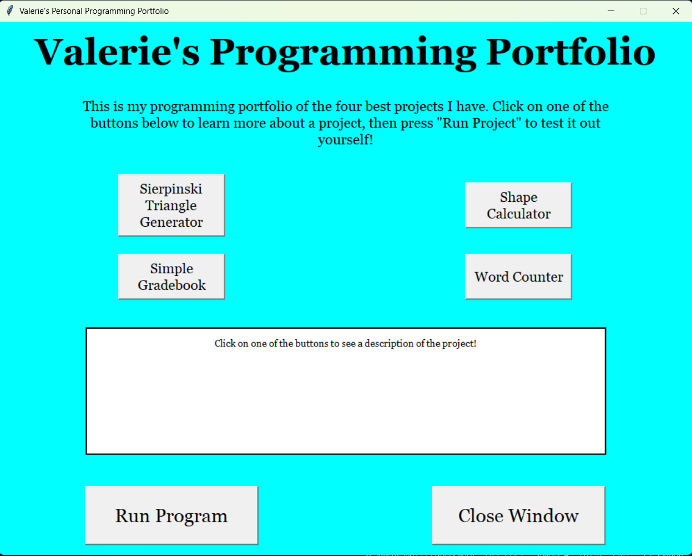

# Personal Portfolio
***

***
This is a program that shows the four projects that I am most proud of. It shows the descriptions, which include a brief summary of what the project does, things I learned, and challenges I faced; and lets the user run the program to test it for themself.

## How to Use
***
1. Open the main.py file
2. Press the run button
3. Read the instructions that are on the window that shows up and click on one of the four buttons to read a description.
4. Click on the "Run Program" button to run the selected program. The tkinter window will be hidden since all programs are accessed through the terminal. Select the option to exit the program in order to go back to the menu window.

## List of Key Features
- It shows the four different projects I made (Fractal Pattern Generator, Geometry Calculator, Simple Gradebook, and Word Counter) and descriptions of them.
- It lets the user run each program to test it out for themself. (This hides the tkinter window.)
- There is a button for closing the window as well.

## Installation instructions
This program uses Python. None of the projects featured uses any external libraries, so as long as the Programming drive is accessible, this should work fine. Note that this project should not be run in Github Codespaces since it uses a tkinter window, and Codespaces does not support this.

## Contributors
- Valerie5801

## License Information
- Utah County Academy of Sciences

## Contributions
- You can make the tkinter window look nicer with more advanced visuals and UI.