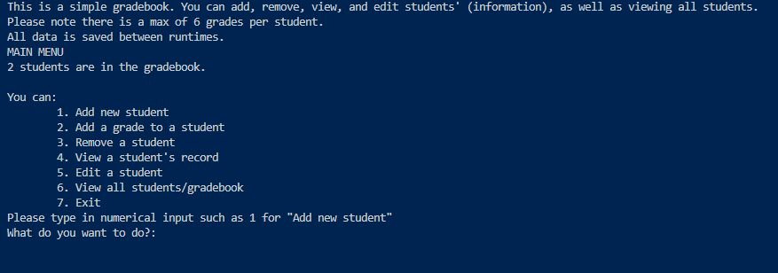

# Simple Gradebook
***

***
This is a program that lets the user add, remove, view, and edit students in a simple gradebook. It also lets them view all students.

## How to Use
***
1. Open the main.py file
2. Press the run button
3. Select one of the available options:
  - Add a new student
  - Add a grade to a student
  - Remove a student
  - View a student
  - Edit a student
  - View all students/the gradebook

## List of Key Features
- It lets the user add students
- At the beginning of the main menu, it tells the user how many students have been made.
- It lets the user remove students
- It lets the user add grades to a student
- It lets the user see a specific student through their student ID
- It lets the user edit a student.
- It lets the user see all students (the gradebook)

## Installation instructions
As long the Programming drive is accessible, this program should work. This program uses Python.

## Contributors
- Valerie5801

## License Information
- Utah County Academy of Sciences

## Contributions
- You can add student details and academic status to the gradebook
- You can add grade statistics of the whole gradebook